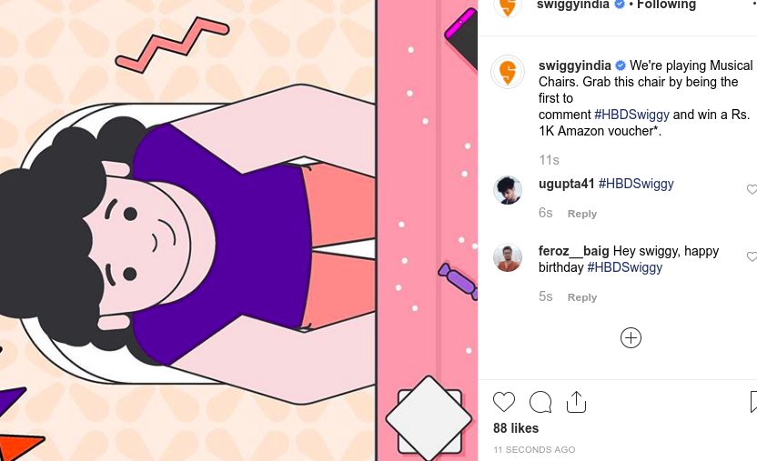
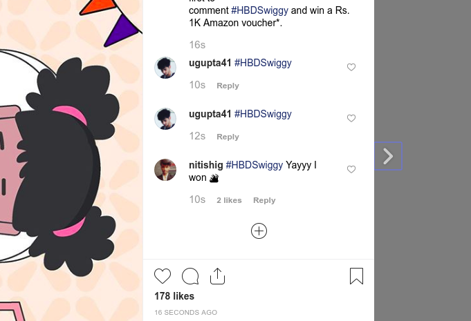
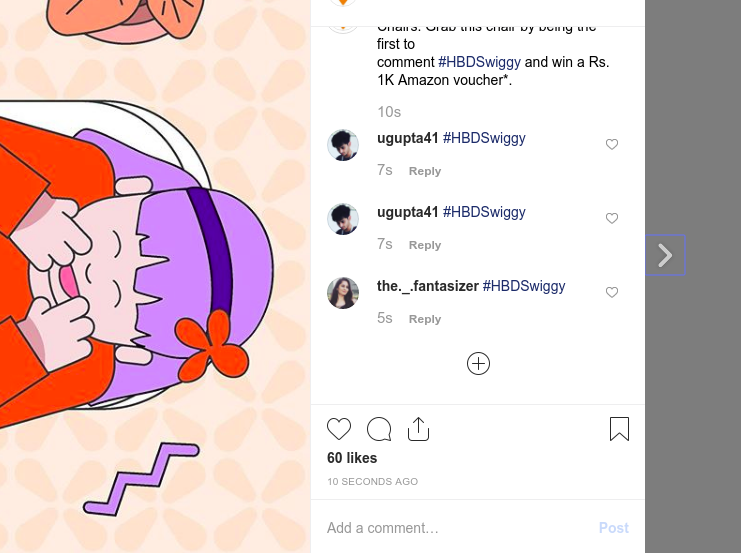

# Swiggy Instagram Offer

## About

Swiggy launched an instagram campaign for their product's anniversary where the first person to comment on their post with "#HBDSwiggy" would win Amazon voucher upto Rs.10,000.

Aaand. Well - I wrote a script to achieve that: https://www.instagram.com/p/B1aplhvhCUE/ (My handle: [ugupta41](https://www.instagram.com/ugupta41/)).

Best thing about it is that the polling part is done without any login (So you can essentially poll asap without any rate-limit) - So Instagram could never figure out that who is making those requests, Add a proxy layer and you've got yourself a scraping machine.

(P.S. This post doesn't bear any rewards because its not a chair - I have deleted my comments (fastest in a post because obviously machines are faster than humans) which were posted on chairs because it'd be unethical to gain an advantage against the ongoing campaign.

(P.P.S I got to know about the campaign like 30 minutes before it began, so the code quality is absymal but again thats a reason its a quick script)

Here are some of the screenshots of the script:

## Installation

1. `git clone https://github.com/slapbot/swiggy-instagram-offer`
2. `cd swiggy-instagram-offer`
3. `python -m venv swiggy-instagram-offer-env`
4. `source swiggy-instagram-offer-env/bin/activate`
5. `pip install -r requirements.txt`

## Usage

1. Add in your username and password in `job_executor.py`
2. Run `python test.py`

## Potential Re-uses

1. You can use it to impress your crush by posting the first comment in her new posts.
2. Yeah.
